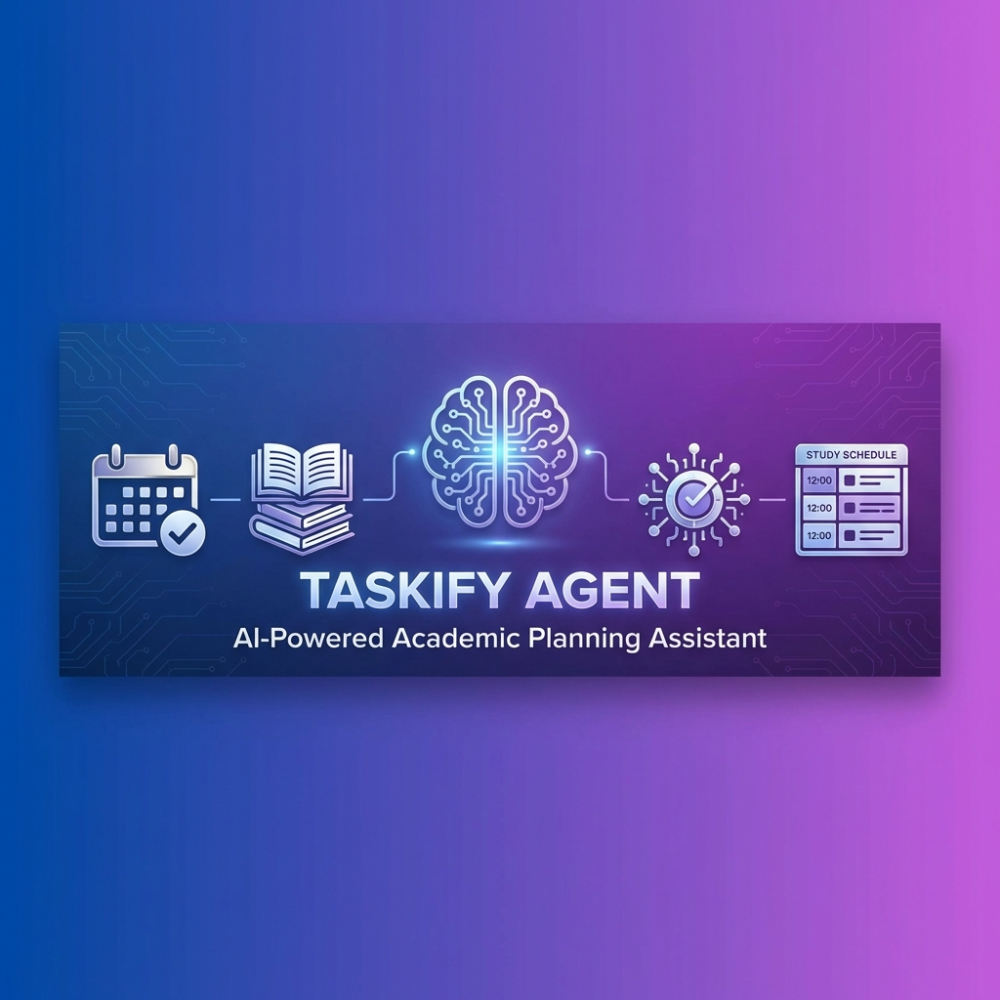
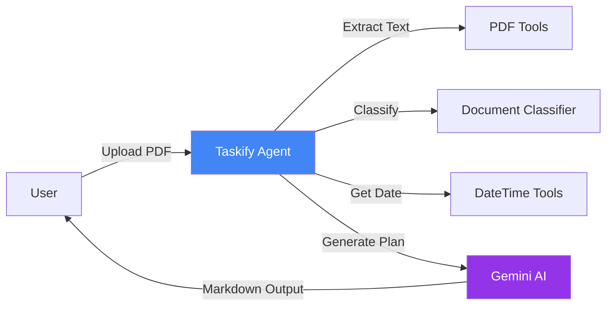

<div align="center">



# 🎓 Taskify Agent

**AI-Powered Academic Planning Assistant**

[](https://opensource.org/licenses/MIT)
[](https://www.python.org/downloads/)
[](https://github.com/google/adk)
[](CONTRIBUTING.md)

*Transform exam stress into strategic success with AI-powered study planning*

[Features](#-features) • [Quick Start](#-quick-start) • [Documentation](#-documentation) • [Examples](#-examples) • [Contributing](#-contributing)

</div>

---

## 📖 Overview

**Taskify Agent** is an intelligent academic planning assistant that helps students create personalized, adaptive study schedules by analyzing:

- 📅 **Exam Timetables** - Automatically extract dates and deadlines
- 📚 **Course Syllabi** - Identify topics and coverage areas
- 📝 **Previous Year Questions (PYQs)** - Prioritize high-weightage topics
- 📋 **Assignments** - Balance coursework with exam preparation
- ⏰ **Your Schedule** - Respect your time constraints and preferences

Built with **Google's Agent Development Kit (ADK)** and powered by **Gemini AI**, Taskify Agent acts as your personal academic mentor, providing realistic, actionable study plans in beautiful markdown format.

---

## ✨ Features

### 🤖 Intelligent Planning
- **Adaptive Scheduling** - Automatically adjusts plans based on urgency and priorities
- **PYQ Analysis** - Identifies frequently tested topics for focused preparation
- **Emergency Mode** - Special planning for exams ≤3 days away
- **Conflict Resolution** - Balances assignments with exam preparation

### 📄 Document Processing
- **PDF Text Extraction** - Reads exam schedules, syllabi, and PYQs
- **Smart Classification** - Automatically identifies document types
- **Security Validated** - File size limits, path traversal prevention

### 🎨 User Experience
- **Visual Markdown Output** - Beautiful tables, emojis, and structured formatting
- **Priority Indicators** - Color-coded urgency levels (🔴🟠🔵⚪)
- **Break Management** - Automatic break scheduling to prevent burnout
- **Realistic Schedules** - Never exceeds healthy study hour limits

### 🔒 Production Ready
- **Type-Safe** - Full type hints for better IDE support
- **Secure** - API key protection, input validation, error handling
- **Configurable** - Environment-based configuration
- **Containerized** - Docker support for easy deployment
- **Logged** - Comprehensive logging for debugging

---

## 🚀 Quick Start

### Prerequisites
- Python 3.11 or higher
- Google AI API key ([Get one here](https://makersuite.google.com/app/apikey))
- Google ADK installed

### Installation

#### Option 1: Local Setup (Recommended)
```bash
# Clone the repository
git clone https://github.com/yourusername/taskify-agent.git
cd taskify-agent

# Create virtual environment
python -m venv venv
source venv/bin/activate  # On Windows: venv\Scripts\activate

# Install dependencies
pip install -r requirements.txt

# Configure environment
cp .env.example .env
# Edit .env and add your GOOGLE_API_KEY
```

#### Option 2: Docker
```bash
# Clone the repository
git clone https://github.com/yourusername/taskify-agent.git
cd taskify-agent

# Create .env file
cp .env.example .env
# Edit .env and add your GOOGLE_API_KEY

# Run with Docker Compose
docker-compose up
```

### Running the Agent

```bash
# Activate virtual environment (if not already active)
source venv/bin/activate

# Run the agent
adk run agent.py
```

The agent will start and be ready to assist with your academic planning!

---

## 📚 Documentation

### Configuration

Edit `.env` file to customize settings:

```bash
# Required
GOOGLE_API_KEY=your_api_key_here

# Optional
AGENT_MODEL=gemini-2.0-flash-exp  # AI model to use
MAX_PDF_SIZE_MB=10                # Maximum PDF file size
MAX_PDF_PAGES=100                 # Maximum pages to process
LOG_LEVEL=INFO                    # Logging verbosity
```

### Project Structure

```
taskify-agent/
├── agent.py              # Main agent definition
├── config.py             # Configuration management
├── tools/                # Utility modules
│   ├── pdf_tools.py      # PDF extraction & classification
│   └── datetime_tools.py # Date/time utilities
├── examples/             # Usage examples and samples
├── assets/               # Images and media
├── requirements.txt      # Python dependencies
├── Dockerfile            # Container configuration
├── docker-compose.yml    # Docker orchestration
├── .env.example          # Environment template
└── README.md             # This file
```

### Available Tools

| Tool | Description |
|------|-------------|
| `extract_pdf_text` | Extract text from PDF files (max 10MB) |
| `classify_document` | Identify document type with confidence score |
| `get_current_datetime` | Get current UTC date/time for planning |

---

## 💡 Examples

### Example 1: Creating a Study Plan

```
You: [Upload exam_timetable.pdf]

Agent: 📅 I've analyzed your exam schedule:
- Mathematics: Jan 20, 2026 (8 days) 🔵 Medium
- Physics: Jan 22, 2026 (10 days) 🔵 Medium
- Chemistry: Jan 25, 2026 (13 days) 🔵 Medium

How many hours per day can you study?

You: 6 hours per day

Agent: [Generates detailed day-by-day study plan with tables]
```

### Example 2: Emergency Planning

```
You: I have a Physics exam in 2 days and haven't started!

Agent: 🚨 Emergency Mode Activated

I'll create a focused plan covering only the most critical topics.
Upload your PYQ papers so I can prioritize high-weightage areas.

[Creates intensive 2-day revision plan]
```

More examples in [`examples/usage_examples.md`](examples/usage_examples.md)

---

## 🏗️ Architecture



---

## 🧪 Testing & Validation

### Security Check
```bash
# Check for dependency vulnerabilities
pip install safety
safety check -r requirements.txt
```

### Code Quality
```bash
# Linting
pip install ruff
ruff check .

# Type checking
pip install mypy
mypy agent.py tools/ --ignore-missing-imports
```

### Docker Build
```bash
docker build -t taskify-agent .
docker run -e GOOGLE_API_KEY=your_key taskify-agent
```

---

## 🛡️ Security

- ✅ **API Key Protection** - Never logged or exposed
- ✅ **Input Validation** - File size limits, type checking
- ✅ **Path Traversal Prevention** - Secure file access
- ✅ **Non-Root Container** - Docker runs as unprivileged user
- ✅ **Dependency Scanning** - Regular security audits

**Found a security issue?** Please report privately via email.

---

## 🤝 Contributing

We welcome contributions! Please see [CONTRIBUTING.md](CONTRIBUTING.md) for guidelines.

### Quick Contribution Steps
1. Fork the repository
2. Create a feature branch (`git checkout -b feature/amazing-feature`)
3. Commit your changes (`git commit -m 'Add: amazing feature'`)
4. Push to the branch (`git push origin feature/amazing-feature`)
5. Open a Pull Request

---

## 📋 Roadmap

- [ ] Web interface for easier interaction
- [ ] Multi-language support
- [ ] Calendar integration (Google Calendar, Outlook)
- [ ] Mobile app
- [ ] Study progress tracking
- [ ] Collaborative study groups
- [ ] Spaced repetition integration
- [ ] Unit tests and CI/CD

---

## 📄 License

This project is licensed under the MIT License - see the [LICENSE](LICENSE) file for details.

---

## 🙏 Acknowledgments

- **Google ADK Team** - For the amazing agent development framework
- **Gemini AI** - For powering the intelligent planning
- **pypdf** - For reliable PDF text extraction
- **Open Source Community** - For inspiration and support

---

## 📞 Support

- 📧 Email: 
- 💬 Discussions: [GitHub Discussions](https://github.com/yourusername/taskify-agent/discussions)
- 🐛 Bug Reports: [GitHub Issues](https://github.com/yourusername/taskify-agent/issues)
- 📖 Documentation: [Wiki](https://github.com/yourusername/taskify-agent/wiki)

---

<div align="center">

**Made with ❤️ for students everywhere**

⭐ Star this repo if Taskify Agent helped you ace your exams!

[Report Bug](https://github.com/yourusername/taskify-agent/issues) • [Request Feature](https://github.com/yourusername/taskify-agent/issues) • [Documentation](https://github.com/yourusername/taskify-agent/wiki)

</div>
